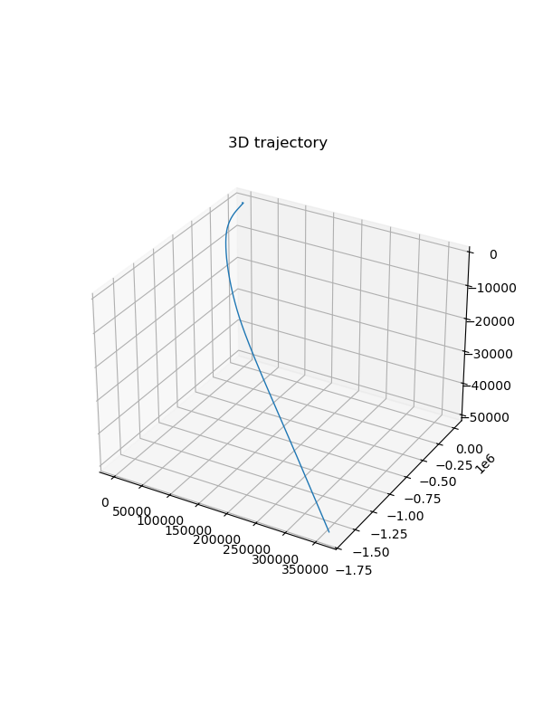

## Convert GPS data to SE(3) 
  - Problem Statement: 
    - Given GPS data: time, latitude, longitude (deg), altitude, heading, heading_valid, orientation: north-east-down. 
    - Compute SE(3) pose whose origin is the first valid GNSS data. 

  - Solution: 
    1. Convert GNNS data to UTM data: zone, hemisphere, easting (x), northing (y). 
    2. Change frame from antenna to body (IMU) 
    3. Compute SE(3) 

  - Components: 
    - Processor class: read, process and write data 
      - GNSS processor: conversion GNSS -> UTM -> SE(3) 
    - Visualization: Python script  
    - GNSS, UTM data class 
    - Main function: define GNSS process flow

- Program arguments: 
  - input data path 
  - output data path 
  - antenna pose: x, y, theta 

## IMU Integration
  - Problem Statement:
    - Given IMU data: timestamp, gyroscope (angular velocity wx, wy, wz), accelerator (ax, ay, az)
    - Compute the state at each timestep position p, velocity v, rotation q, gyroscope bias b_g, accelerator bias b_a, gravity g 

  - Solution: simply integrate IMU data though the state will diverge pretty soon

  - Components:
    - IMU data type, State type
    - IMU integrator
    - Processor class: read, process and write data 
    - IMU processor: simple integration
    - Visualization: Python script  
    - Main function: define IMU process flow 

  - Program arguments:
    - input data path
    - output data path

## Error stata kalman filter
  - Problem Statement:
    - Given IMU, GNSS, Odom data, estimate the state at each timestep (p, v, q, ba, bg, g)
  - Solution: implement error state Kalman filter
  - Component:
    - IMU data type, State type
    - Odom data type: left wheel impulse, right wheel impulse, radius, impulse number per revolution.
    - GNSS, UTM data class
    - Processor class: read, process and write data 
    - Main function: define data processing flow
    - IMU initializer: estimate initial mean accelerator and gyroscope bias, and covariance
    - ESKF: prediction with imu data, correction with odom and gnss data, reset error state and update covariance of the state
      - GNSS data observe and correct position and orientation (only when heading angle is available)
      - Odom data observe and correct the veloicty 
    - Visualization: Python script 
  - Program arguments: 
    - input data path 
    - output data path 
    - antenna pose: x, y, theta 
    - sensor fusion options
  - ESKF results:
    - [shape_data.txt](data/shape_data.txt)

      

      

    - [sensor_data.txt](data/sensor_data.txt)

      

      
  - IMU integration results (for comparison):
    - The state estimations diverge significantly.
    - [shape_data.txt](data/shape_data.txt)

      

      

    - [sensor_data.txt](data/sensor_data.txt)

      

      

### Dependencies
- [Eigen](https://gitlab.com/libeigen/eigen)
- [Sophus](https://github.com/strasdat/Sophus)
- [Glog](https://github.com/google/glog)
- [Gflags](https://github.com/gflags/gflags)

### References
1. [Quaternion kinematics for the error-state Kalman filter
](https://arxiv.org/pdf/1711.02508)

2. [slam in autonomous driving](https://github.com/gaoxiang12/slam_in_autonomous_driving)

3. [GeoConvert](https://github.com/TeraLogics/GeoConvert)